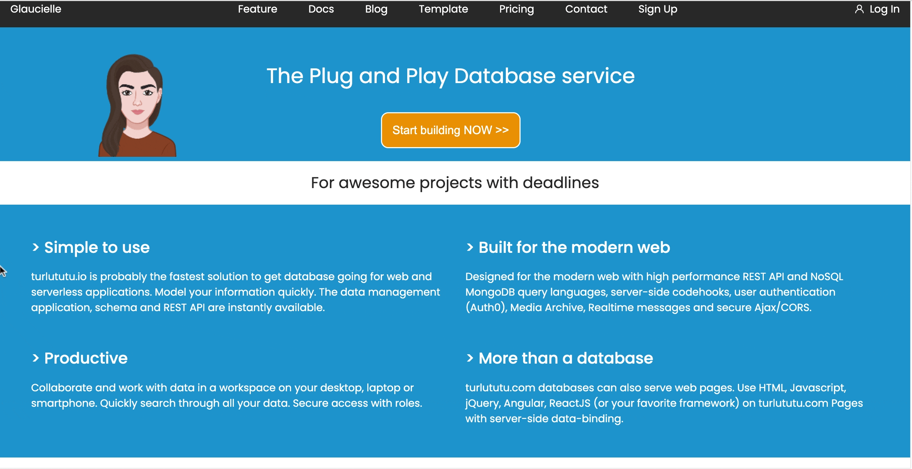

# Progressive enhancement

This is a webpage constructed according to BeCode Junior Developer training course [documentation](https://github.com/becodeorg/BXL-Johnson-09-main-repo/tree/main/1.The-Field/03-Frontend-101-Progressive_enhancement).

# Technologies 🏷️

# Future features ⏱️

- improve css
